

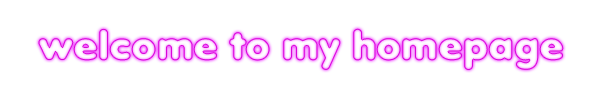
 

 
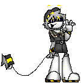
 
<i>create until nothing is left to create</i> 
Tally Hall, Spring and a Storm

  

## About me

I build Minecraft server plugins in Java and small web worlds in TypeScript and plain HTML. Old operating systems, pixel buttons, starfields, Murder Drones and a playlist of Tally Hall, Miracle Musical, Lemon Demon, Will Wood and Graham Kartna live rent free in my head, so they end up in my projects too.

## Now playing

## Main repos

<table>
<tr>
<td width="50%" valign="top">

<h3><a href="https://github.com/VictorGugug/BlockProt-Reloaded">BlockProt Reloaded</a></h3>

Protection plugin for chests, furnaces and more, with a modern GUI. Published on Modrinth, CurseForge and Hangar.

</td>
<td width="50%" valign="top">

<h3><a href="https://github.com/VictorGugug/Zelly-s-Nexus">Zelly's Nexus</a></h3>

All-in-one plugin for Minecraft Java Edition 26.x built around dialog menus: auth, antibot, essentials, clans, chat and more under one <code>/zn</code> command. Early development.

</td>
</tr>
<tr>
<td width="50%" valign="top">

<h3><a href="https://github.com/VictorGugug/M.E">ZarXP</a> &middot; <a href="https://victorgugug.github.io/M.E/">live</a></h3>

Windows XP recreated in the browser with the Luna style: boot screen, Start menu, Internet Explorer 6, Media Player, Paint, Minesweeper and Solitaire.

</td>
<td width="50%" valign="top">

<h3><a href="https://github.com/VictorGugug/Ramosi">Ramosi</a> &middot; <a href="https://victorgugug.github.io/Ramosi/">live</a></h3>

A generative watercolor bouquet of yellow flowers with a white butterfly and a hidden letter. Runs in the browser and as a Windows desktop app.

</td>
</tr>
<tr>
<td width="50%" valign="top">

<h3><a href="https://github.com/VictorGugug/VOAC">Miracle Hall</a> &middot; <a href="https://victorgugug.github.io/VOAC/">live</a></h3>

Fan site about Tally Hall, Miracle Musical and Cojum Dip: history, members, discography and an analysis of Hawaii: Part II.

</td>
<td width="50%" valign="top">

<h3><a href="https://github.com/VictorGugug/HNP">HNP</a> &middot; <a href="https://victorgugug.github.io/HNP/">live</a></h3>

School project about Hiroshima, Nagasaki and Chernobyl, and the role of the imaginary number i in quantum physics. In Spanish.

</td>
</tr>
</table>

## Tech I use

  

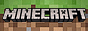

## Things I love

<table>
<tr>
<td align="center" width="170"><b>Murder Drones</b></td>
<td align="center">
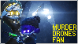
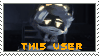
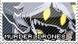
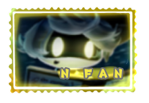
 

</td>
</tr>
<tr>
<td align="center"><b>Space</b></td>
<td align="center">
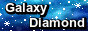
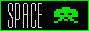

 

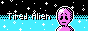
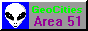
</td>
</tr>
<tr>
<td align="center"><b>Tally Hall Miracle Musical</b></td>
<td align="center">
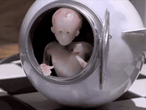
 
Ruler of Everything on repeat, way too much.
 
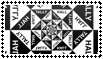
 
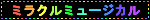
</td>
</tr>
<tr>
<td align="center"><b>Lemon Demon</b></td>
<td align="center">
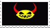
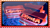
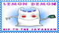
</td>
</tr>
<tr>
<td align="center"><b>Will Wood</b></td>
<td align="center">
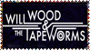
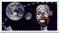
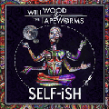
</td>
</tr>
<tr>
<td align="center"><b>Graham Kartna</b></td>
<td align="center">
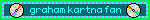
</td>
</tr>
<tr>
<td align="center"><b>Art</b></td>
<td align="center">
Cyber and brutalist posters, dithered bitmaps, wireframe 3D and retro-futurism.
 
<a href="https://www.pinterest.com/ZarVickey/i-like-this/">My board on Pinterest</a>
</td>
</tr>
</table>

## Other orbits

Forks I tinker with: [spicy-lyrics](https://github.com/VictorGugug/spicy-lyrics), [spicetify-lucid](https://github.com/VictorGugug/spicetify-lucid) and [Hazy](https://github.com/VictorGugug/Hazy) for Spicetify, plus lyric tools like [lyricsfile](https://github.com/VictorGugug/lyricsfile) and [NaeNae-AMLL-TTML-TOOL](https://github.com/VictorGugug/NaeNae-AMLL-TTML-TOOL).

 

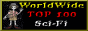

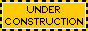
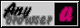

## Credits

- Murder Drones stamps, blinkie and pixel drone by [ppepprerde](https://www.deviantart.com/ppepprerde/art/A-few-murder-drones-web-graphics-1219837343), [shortcakeemoji](https://www.deviantart.com/shortcakeemoji/art/MURDER-DRONES-STAMP-1302053382) and [SketchyRaven](https://www.deviantart.com/sketchyraven/art/Murder-Drones---N-Fan-Stamp-1213528907), shared as free to use. Murder Drones belongs to Glitch Productions.
- Music stamps and blinkies by [i-psofacto](https://www.deviantart.com/i-psofacto/art/Tally-Hall--Good-and-Evil-stamp-805188216) (Tally Hall, Will Wood), [cyberdaydream](https://www.deviantart.com/cyberdaydream/art/Miracle-Musical-Blinkie-1016039701) (Miracle Musical), [gorillazdotcom](https://www.deviantart.com/gorillazdotcom/art/lemon-demon-stamp-792572556) and [darklord1765](https://www.deviantart.com/darklord1765/art/lemon-demon-view-monster-stamp-1254622557) (Lemon Demon), shared as free to use. The Graham Kartna blinkie was made with [blinkies.cafe](https://blinkies.cafe/).
- 88x31 buttons from [The 88x31 GIF Collection](https://cyber.dabamos.de/88x31/).
- Logos made with [Cool Text](https://cooltext.com/).
- Icons by [skillicons.dev](https://skillicons.dev/). Live status card by [lanyard-profile-readme](https://github.com/cnrad/lanyard-profile-readme).
